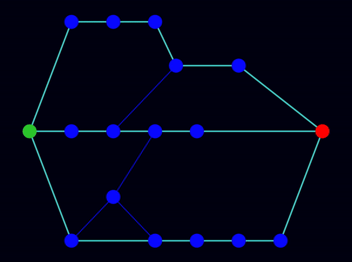
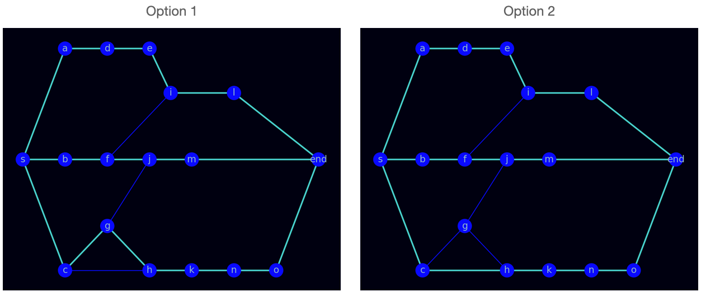
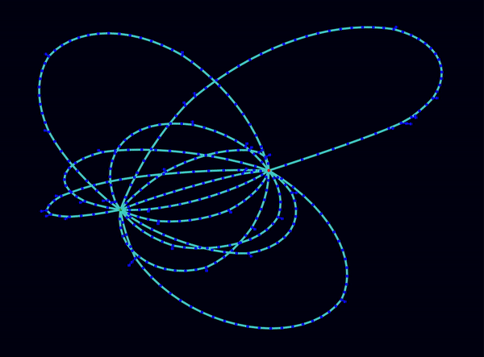

# Lem-in

In this project, we are given an ant farm composed of rooms and links, and our task is to find the optimum path combination to move the ants as fast as possible from start to end. We must avoid traffic jams because the rules dictate each room, except the start and end rooms can contain one ant at a time.

With this project, we gained hands-on experience in graph theory, maximum flow algorithms, adjacency list representation of graphs, and implementing hash tables in the C programming language.

For detailed instructions, refer to [the subject](subject.pdf).

<p align="center">
  
</p>

# Table of Contents
1. [Input](#input)
2. [Output](#output)
3. [Strategy](#strategy)
4. [Error management](#error-management)
5. [Installation](#installation)
6. [Usage](#usage)
7. [Visualizer](#visualizer)
8. [Test scripts](#test-scripts)

## Input
Our program receives data in the following format from stdin:
- Number of ants (positive integers)
- Rooms (name coord_x coord_y)
- `##start` command followed by the start rooms information
- `##end` command followed by the end room information
- Links (name1-name2)
- Comments can be anywhere; they start with a `#`

An example input:
```
#comment
3
##start
start 1 0
##end
end 5 0
room1 9 0
room2 13 0
#comment
start-room1
room1-room2
room2-end
```

## Output
Results are displayed in stdout in the following format:
- First, the given map is printed
- Then, ants (L1-room_name, L2-another_room_name, ...) moving in rooms are printed
```
#comment
3
##start
start 1 0
##end
end 5 0
room1 9 0
room2 13 0
#comment
start-room1
room1-room2
room2-end

L1-room1
L1-room2 L2-room1
L1-end L2-room2 L3-room1
L2-end L3-room2
L3-end
```

## Strategy
We aim to find the optimal combinations of node-disjoint paths for the given amount of ants. We find the paths using a modified version of the Edmonds-Karp maximum flow algorithm.

1. Parse rooms and create nodes
    - Since the edges provided are undirected, to make it a directed graph, we split the rooms into two nodes: node<sub>in</sub> and node<sub>out</sub>.
2. Parse links and create an adjacency list
    - Rooms A and B are connected like this:
        ```
        node_A_in   --> node_A_out
        node_A_out  --> node_B_in
        node_B_out  --> node_A_in
        node_B_in   --> node_B_out
        ```
3. Get paths and decide when to stop finding more paths
    - While a flow is possible, run a breadth-first search (BFS) to find the shortest path from start to end
    - Create the residual flow for this path
    - Run another BFS to save the path. Here, we use two options and keep two different path sets: 
        - Option 1: Finds the paths following the edges only found with the Edmonds-Karp algorithm (the ones with the residual flow)
        - Option 2: Explores the edges found with the Edmonds-Karp and the edges that are not visited during the Edmonds-Karp algorithm. If the unvisited edge leads to a shorter path, we save it.
    - Here is how we save our augmenting path sets:
		- In the first iteration of the BFS, we save our first path set, which consists of only one path
		- In the second iteration, we save two paths
		- In the third iteration, we save three paths and so on...
    - When to stop:
		- We calculate the number of lines to be printed for the previous path set and the current path set.
		- If the previous path set provides fewer lines than the current one for the given ant number, we return the previous one and stop the path-finding algorithm. 
4. Compare the two options and send ants using the best option
    - Once we know which path set to use, we create a queue to send ants. We send the ants one by one and print the lines.

<p align="center">
	
	<p align="center"><b>An example graph showing how Option 2 finds a shorter path compared to Edmonds-Karp algorithm</b></p>
</p>

## Error management
- If the input file has faulty lines, the program displays a specific error message pointing to the faulty line and exits.
- If there is no possible solution, the program prints "Error: No end" and exits.


Some example outputs in case of an error:
```
test_maps/error/invalid_double_end.map:
Error: in line 7: More than one end
--------------
test_maps/error/invalid_double_start.map:
Error: in line 7: More than one start
--------------
test_maps/error/invalid_empty_line.map:
Error: in line 8: Empty line
--------------
test_maps/error/invalid_end.map:
Error: No end
```

## Installation
```
git clone git@github.com:Bengissimo/Lem-in.git
```
```
make
```

## Usage
```
Usage: ./lem-in [OPTION] < valid_map

 -h     help
 -p     print sets of possible paths and number of lines to print
 -v     enable visualizer
```

## Visualizer
```
Visualizer usage: ./lem-in -v < valid_map | python3 visualizer/visualizer.py [OPTION]

 --coord        to use coordinates, random nodes position by default
 --slow         slow animation of moving ants
 --fast         fast animation of moving ants
 --big          use with big maps

Visualizer uses networkx, matplotlib, numpy, scipy. Be sure that you have these packages installed

pip3 install networkx matplotlib numpy scipy
```

<p align="center">
  
  <p align = "center"><b>Visualizer running with --big and --coord options</b></p>
</p>

## Test scripts
1. test.sh
	- This script generates 5 different random maps for flow one, flow ten, flow thousand, big maps and big superposition maps
	- The number of lines required is compared with the line number obtained from the lem-in's output and printed to the stdout
2. error.sh
	- This scripts runs the program with many different error cases
3. leaks.sh
	- This script runs the leaks command at exit with one correct map and with all error cases
	
```
cd test/
./test.sh
./error.sh
./leaks.sh
```


